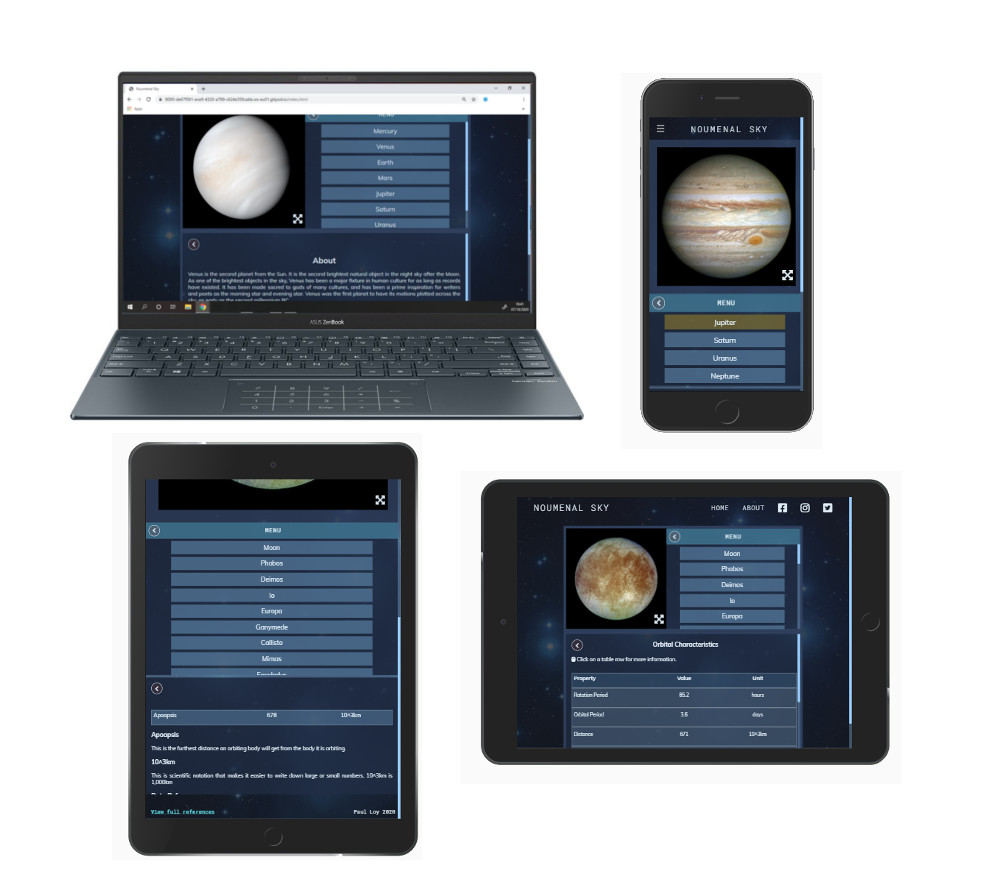
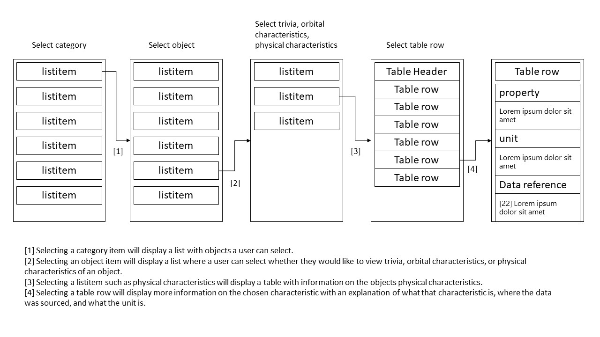
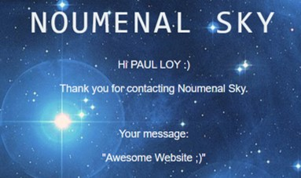
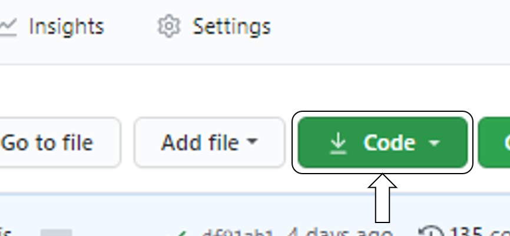
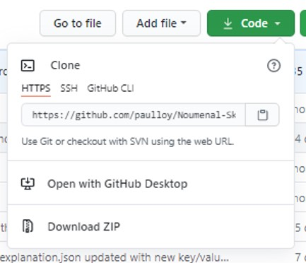

# Noumenal Sky

## Code Institute: Milestone Project 2, Interactive Frontend Development

The main goal of this project is to provide the user with an educational experience with an interactive site that responds to user actions and allows the user to display their preferred information to achieve their goals.

Noumenal Sky is designed to be a user-friendly website for learning various facts about objects in our solar system; such as planets, their respective moons, and so on. For each object the user is provided with some trivia; name origins and discovery details,
and information on their physical and orbital characteristics. Alongside the physical and orbital characteristics are brief explanations of the lexicon used that a user may be unfamiliar with, such as "bond albedo," or "periapsis." Each data point
such as the mass of Earth or the density of Jupiter is provided with a reference to the source of the data so that the user may visit the source themselves and be assured that the website provides accurate data.

My hope is that Noumenal Sky is useful to curious newcomers who want to learn about the solar system, or even undergraduate physics students who want to make use of the data and references provided. The About page provides a new user
with an FAQ to aid them, and a contact form that may allow a user to contact the developer about any concerns with the website; maybe an explanation of some lexicon isn't clear enough, or a reference has been redacted or isn't the most up to date.

[Click here to view the live project](https://paulloy.github.io/Noumenal-Sky/index.html)

## Table of Contents

- [UX](https://github.com/paulloy/Noumenal-Sky#ux)
  - [Project Goals](https://github.com/paulloy/Noumenal-Sky#project-goals)
  - [User Goals](https://github.com/paulloy/Noumenal-Sky#user-goals)
  - [Project Wireframe](https://github.com/paulloy/Noumenal-Sky#project-wireframe)
  - [User Stories](https://github.com/paulloy/Noumenal-Sky#user-stories)
  - [UX Design Process](https://github.com/paulloy/Noumenal-Sky#ux-design-process)
    - [Strategy](https://github.com/paulloy/Noumenal-Sky#Strategy)
    - [Scope](https://github.com/paulloy/Noumenal-Sky#scope)
    - [Structure](https://github.com/paulloy/Noumenal-Sky#structure)
    - [Skeleton](https://github.com/paulloy/Noumenal-Sky#skeleton)
    - [Surface](https://github.com/paulloy/Noumenal-Sky#surface)
- [Features](https://github.com/paulloy/Noumenal-Sky#features)
  - [Home](https://github.com/paulloy/Noumenal-Sky#home)
  - [About](https://github.com/paulloy/Noumenal-Sky#about)
  - [References](https://github.com/paulloy/Noumenal-Sky#references)
  - [Future Features](https://github.com/paulloy/Noumenal-Sky#future-features)
- [Technologies Used](https://github.com/paulloy/Noumenal-Sky#technologies-used)
- [Testing](https://github.com/paulloy/Noumenal-Sky#testing)
  - [User Stories](https://github.com/paulloy/Noumenal-Sky#user-stories-1)
  - [noscript](https://github.com/paulloy/Noumenal-Sky#noscript)
  - [Home/Menu](https://github.com/paulloy/Noumenal-Sky#home--menu)
  - [Home/Image](https://github.com/paulloy/Noumenal-Sky#home--image)
  - [Home/#bottom-container](https://github.com/paulloy/Noumenal-Sky#home--bottom-container)
  - [Home Responsive Design](https://github.com/paulloy/Noumenal-Sky#home-responsive-design)
  - [About/FAQ](https://github.com/paulloy/Noumenal-Sky#about--faq)
  - [About/Contact Us](https://github.com/paulloy/Noumenal-Sky#about--contact-us)
  - [About Responsive Design](https://github.com/paulloy/Noumenal-Sky#about-responsive-design)
  - [References](https://github.com/paulloy/Noumenal-Sky#references-1)
  - [Validation](https://github.com/paulloy/Noumenal-Sky#validation)
  - [Accessibility](https://github.com/paulloy/Noumenal-Sky#accessibility)
  - [Additional Testing](https://github.com/paulloy/Noumenal-Sky#additional-testing)
  - [Automated Testing](https://github.com/paulloy/Noumenal-Sky#automated-testing)
  - [Browsers](https://github.com/paulloy/Noumenal-Sky#browsers)
  - [Bugs](https://github.com/paulloy/Noumenal-Sky#bugs)
- [Deployment](https://github.com/paulloy/Noumenal-Sky#deployment)
  - [Live Deployment](https://github.com/paulloy/Noumenal-Sky#live-deployment)
  - [Local Deployment](https://github.com/paulloy/Noumenal-Sky#local-deployment)
- [Credits](https://github.com/paulloy/Noumenal-Sky#credits)
  - [Content](https://github.com/paulloy/Noumenal-Sky#content)
  - [Media](https://github.com/paulloy/Noumenal-Sky#media)
  - [Acknowledgements](https://github.com/paulloy/Noumenal-Sky#acknowledgements)

## UX

### Project Goals

- Develop an interactive website with an intuitive navigation structure that new users may navigate with ease.
- Develop a responsive website design that will adjust well to all device widths between 320px and 1242px.
- Provide a user with an educational experience with information that is accessible and easy to understand.
- To build a website in line with good coding practice.

### User Goals

- An easy way to learn new information about the solar system.
- Accessible with mobile, tablet, or desktop.
- To feel that use of this website is meaningful.

### Project Wireframe

The project wireframe was redesigned throughout the course of the project to provide a better user experience. In testing the intital wireframe design on friends and family it ended up being confusing to navigate.
Lists on mobile were too small and the responsive design was poor. The final project wireframe is an improvement over the initial design and now users seem to be able to navigate it better.
The Contact and About page were both added to one page called "About" in the final design.

[Initial Project Wireframe](assets/wireframes/initial-project-wireframe.pdf)

The initial project wireframe served as a good starting point and with user feedback provided me with better solutions for UX.

[Deployed Project Wireframe](assets/wireframes/project-wireframe.pdf)

### User Stories

- As a user I want to be able to find the data I want on any object with an easy navigation structure to understand.
- As a user I want a visually appealing design with high quality images that load quickly.
- As a user with visual impairment, I want a website that I can navigate by keyboard and with a screen reader.
- As a user, I want to be able to leave feedback to the developer.
- As a user I want good feedback from the page so I do not get lost while navigating.
- As a user I want to learn more about the solar system and the lexicon that astrophysicists use.

### UX Design Process

#### Strategy

My initial idea for this project was to create an educational website where a user could go to learn some more about solar system objects such as planets, moons, etc. I decided to settle on providing the user with content on
the physical and orbital characteristics of these objects as this is a topic I have the most familiarity with; having studied undergraduate physics in university.

#### Scope

- **Content Requirements:**
  The content I wanted to present to the user was an image of the object they were viewing with a description about the image, such as when it was taken and with what equipment. I wanted to include some interesting trivia on the objects
  such as when they were discovered, or the origin of their names. Then I wanted to include information on the physical and orbital characteristics of the objects with references to where the data was sourced, and explanations on what
  the presented lexicon meant for a user who didn't understand it. e.g. I hope to educate users on what lexicon such as periapsis, bond albedo, astronomical units, etc are.
  I wanted to provide the user with an FAQ to answer any common questions they may have about the project. If the FAQ didn't answer their question, I wanted to provide them with a contact page with which they may contact the developer with
  any questions or feedback they have. I wanted to provide the user with a full list of references from where I collected my data so they can be assured that it is accurate.

- **Functional Requirements:**
  I planned to create a set of lists that a user can click through to find an object they want to view and select what information they would like to learn more about.
  

#### Structure

- **Interaction Design:**
  I felt it would be best to include all lists on one page so a user is not having to constantly load separate pages and get lost. I wanted to create a simple navigation structure that was intuitive to use. The user clicks through different
  lists to get the information they want. The lists should display only those elements they are able to interact with and hide elements that have already been interacted with, with the ability to return to a previous list at anytime.
  The FAQ and contact form would be placed in a separate page.

- **Information Architecture:**
  I thought it was best to have all information displayed within five divs. It would be too confusing to navigate if one object opened more or less divs than another. After interacting with a few elements, the user should feel confident that they
  can navigate the project with ease. I aim to effectively organize the information so that a user may accomplish their goals.

#### Skeleton

My [initial project wireframe](assets/wireframes/initial-project-wireframe.pdf) proved to be a poor navigational design. When tested on friends and family it became obvious that the lists provided were confusing to navigate and the information
was not well organized. Following this I designed a new wireframe for the project and split my information into several JSON files organized into various folders to work with my new design.

I developed a [new project wireframe](assets/wireframes/project-wireframe.pdf) that had a better navigation that my friends and family seemed to be able to explore with ease and intuitively grasp its navigation structure.

#### Surface

I decided to use consistent colours for highlighting elements that are hovered over or focused on. The Category and Object lists are displayed next to or below the displayed object image. The bottom container contains the information that
a user will navigate to find and display information on the object. Each explanantion contains a link to the specific reference that a data point was collected from and a link to references.html where the full list of references is
available to view. A link to the full references is also contained within the footer on index.html. I use images of nebula as background images for each page so that they are visually appealing.

## Features

The header contains the website logo, and a navigation bar (navbar) with links to Home (index.html), and About (about.html), and three social media links.

### Home

The home page consists of interactive lists. The main div id's are:

- **#category-list**
  - This will display a list of categories a user can select. These currently are "Planets," "Dwarf Planets," "Moons," and "Other." Clicking one of these will bring up a unique list in "object-list" that a user can click.
    Planets will display 8 listitems. Dwarf Planets will display 5 listitems. Moons will display 23 listitems. Other will display 6 listitems. Moons is not exhaustive as there are so far 219 moons discovered. Other contains
    miscellaneous objects such as a comet, asteroid, minor planets, etc.
    After selecting a category, "category-list" will hide and "object-list" will display.
- **#object-list**
  - This will display a list of objects that a user can select. On clicking on one of these, a photo of the object will be displayed to the left of the list or above it depend on what screen size a user is viewing the website on.
    A new list will also be displayed in "info-selection." A button will appear at the top of the list to allow a user to return to the "category-list."
- **#info-selection**
  - Displayed here will be a list of mostly 3 listitems; some objects will display only 2 listitems. These items will be "about," "physical characteristics," and "orbital characteristics." "about" will display trivia on the object
    in "display-info," and the other two lists will display tables will data in "display-info." "info-selection" will hide and "display-info" will display.
- **#display-info**
  - If a table is displayed, a user may click a table row to bring up information in "row-info." This will hide "display-info," and display "row-info." A return button will be displayed at the top left of "display-info" so a user can
    return to "info-selection."
- **#row-info**
  -this will display the table row the user clicked on. Below that will be a heading of the property name with a brief explanation of that property. Below that will be a heading of the unit with an explanation of that unit.
  Below this will be a final heading titled "Data Reference," which will give the user a link to the source of the value in the row with an author name and title. Below this will be a link to references.html for a full list
  of references from where data was gathered for this website. A return button will appear at the top left of "row-info" that will allow a user to return to "display-info."

Selecting the icon at the bottom right of an object image will display a modal with an enlarged image and some information about the image. This modal can be hidden by selecting an icon that appears at the top right of the modal.

### About

- Frequently Asked Questions.

The FAQ features an accordion. A user clicks on a question and the answer will slide down below the question. This is to prevent a page from becoming too long
and frustrating the user with too much scrolling.

- Contact form

There is a contact form that a user may fill out to provide Noumenal Sky with feedback.

Email.js is used so that a user may send messages to the Website author. They receive an email with the message they sent, and the author receives a bcc.

### References

All data used is referenced and the full list of references can be viewed on references.html. Particular references are provided on index.html.

### Future Features

- For now the social media links don't link to any particular page. I may create social media pages for the website to update users on when the project will next be updated.
- I intend on expanding on this websites content. Since the list of moons is very large, I may create some extra lists to split them up and appropriately name them so that the moon lists are not too large. I would like also to remove some
  items from "other" and add them to new categories, such as asteroids, comets, minor planets, and so on.
- The UX could always be improved with new ideas for easier and intuitive navigation. I will likely get more feedback on how to improve this as new users visit the deployed website.
- Update the project so that it functions better on older browsers such as Internet Explorer.
- Since the project has many shades of blue, it would be good to add settings that will allow a colour blind user to change the colours to suit them better.
- Book recommendations for further learning.
- Get access to a screen larger than 1242px and improve the responsive design.
- Include explanations not just on what a property describes about an object but also how that property is measured. e.g. We usually measure our own mass with bathroom scales but how do we measure the mass of a planet? Or the distance without a ruler?
- Occasionally prompt the user to ponder interesting questions about the data they are viewing. e.g. After viewing the density of Saturn and Earth, generate a popup with a question such as "Saturn is more massive than Earth, but why is Earth
  denser than Saturn?" Then give the user a link to a source that may explain this question, or allow it to encourage them to think deeper about the data they are viewing.
- Include explanations of what definitions an object must meet in order to be categorised as a particular type of object. Why is one object a dwarf planet but another a minor planet? Could these objects be separated further?
- Like how references.html can allow the user to view the full list of references from where I collected data, I may create a glossary page containing the full list of explanations for terms used throughout the website.

## Technologies Used

- [HTML5](https://www.w3schools.com/html/default.asp) - Used for structuring and presenting content.
- [CSS3](https://www.w3schools.com/css/default.asp) - Used to style the HTML in accordance with the project wireframes.
- [JavaScript](https://www.w3schools.com/js/default.asp) - Used to make the project interactive.
- [JQuery](https://jquery.com/) - Used to simplify DOM manipulation and JavaScript.
- [Google Chrome Developer Tools](https://developers.google.com/web/tools/chrome-devtools/) - Aided with responsive design and accessibility.
- [Gitpod](https://www.gitpod.io/) - The project was developed on the Gitpod IDE.
- [Git](https://git-scm.com/) - Used to track website changes.
- [GitHub](https://github.com/) - This hosted my repository and changes made with Git.

## Testing

> **Note on pixelated object images:**
> Most object images are high quality, but some such as Sedna or Puck are pixelated, as these are the best images available of those objects, and not because I made an error in obtaining small image sizes that are stretched too large.

### User Stories

- As I user I want to be able to find the data I want on any object with an easy navigation structure to understand.

  - The user is provided with a list from which they can select what type of object they want to view. Selecting "Planet" will display a new list of planets and hide the category list as this is no longer needed. If they wish to choose some
    other category such as "Moons" they can select a button that will display the category list and hide the object list. Then the user may select moons and a new list of moons will appear in #object-list.
    They can then select a moon such as Phobos, which will display a new list they can select. If they want to know the mass of Phobos, they can click on "Physical Characteristics" to have a table appear wherein the mass of Phobos is displayed.
    When something new is displayed in a window and the previously interacted item is hidden, a button will always appear to allow the user to return to the previous display they were interacting with.

- As a user I want a visually appealing design with high quality images that load quickly.

  - I had to balance high quality images with loading time, so I carefully choose high quality images for the user and compressed the files so that they could load quickly.

- As a user with visual impairment, I want a website that I can navigate by keyboard and screen reader.

  - Each image has an alt attribute for screenreaders. Using Google Chrome developer tools I checked every element that contains text to ensure that the font contrasted well with the background. Every interactive element has a role, a name, and can
    be focused on and selected by clicking, or pressing the enter or space key.

- As a user, I want to be able to leave feedback to the developer.

  - The About page contains a contact form that a user may use to contact the developer.

- As a user I want good feedback from the page so I do not get lost while navigating.

  - Elements that have been interacted with will usually hide and some other elements will display, so that it is obvious an element has been successfully selected.

- As a user I want to learn more about the solar system and the lexicon that astrophysicists use.
  - Each table can be selected by a user to display more information to the user on the lexicon used.

### noscript

Each page contains a noscript element that will display the message "Please enable JavaScript to use this website. This can be done in your browser settings" if JavaScript is disabled. Once JavaScript is enabled and a user reloads the page
the website will function as intended.

### Home / Menu

1. Selecting a #category-list item will hide this list and display #object-list in the menu with a return button.
1. Selecting the return button will hide the #object-list and display the #category-list.
1. Selecting an #object-list item will display an image of the object, and the #bottom-container will display containing #info-selection, which will contain a heading with the object name and list.

### Home / Image

1. Selecting the icon at the bottom right of the image will display a modal with an enlarged image and article containing the object name and a description of the image.
1. Selecting the icon at the top right of the modal, or clicking outside the modal will hide the modal.

### Home / #bottom-container

1. Selecting "About" will hide #info-selection and display #display-info with trivia on the selected object.
1. Selecting the return icon will hide #display-info and display #info-selection again.
1. Selecting an item in #object-list while #display-info is displayed will display #info-selection and hide #display-info.
1. Selecting "Physical Characteristics," or "orbital Characteristics" will display #display-info with a table on the Orbital or Physical Characteristics of the object.
1. Selecting a row in #display-info will hide #display-info and display #row-info with the selected row and more information on the row property, value, and unit.
1. Selecting the return icon will hide #row-info and display #display-info again.
1. Selecting the hyperlink icon next to the data reference will display a new browser window with the data reference source.
1. Selecting "Click for full references" will load references.html.
1. Selecting an item in #object-list while #row-info is displayed will display #info-selection and hide #row-info.

### Home Responsive Design

1. At a width of 810px the image will move above the menu with a new border around it. It will take up the full screen width. The menu will take up the full screen width, and the #bottom-container will take up the full screen width.
1. At a width of 750px the navbar will hide and a navbar toggle icon will display that a user can select.
1. Selecting the navbar toggle icon will push the body out of the window to make space for the navbar which will move in from the left side of the window. The navbar toggle icon will change from a burger icon into a cross icon.
1. Selecting the navbar toggle icon again, or clicking outside of the navbar will hide the navbar, move the body back to its original position and change the navbar toggle icon back into a burger icon.
1. At 400px the footer will display as a column.

### About / FAQ

1. Selecting a question will cause the answer to display below the selected question.
1. Selecting the question again will cause the answer to hide.

### About / Contact Us

1. Selecting send message with empty inputs will display "Please fill in this field." below Name.
1. Selecting send message with Name filled only will display "Please fill in this field." below Email.
1. Selecting send message with an email filled without an @ will display "Please include and '@' in the email address."
1. Selecting send message with an email filled with a@ will display "Please enter a part following '@'. 'a@' is incomplete."
1. Selecting send message with an empty Your Message will display "Please fill in this field."
1. Selecting send message with all inputs filled will display a message below the send message button saying "Message Sent." The input fields will empty, their background colours will change and they will be disabled. The user must reload the page
   to send a new message.

### About Responsive Design

1. At a width of 900px the contact form will hide, the FAQ will take up most the window width and a new button will display above the FAQ called "View Contact."
1. Selecting view contact will hide the FAQ and display the contact form with a button above it displaying "View FAQ."
1. Selecting view FAQ will hide the contact form and display the FAQ with the view contact button.

### References

1. Clicking a hyperlink icon will display a new browser window with the appropriate source.

### Validation

- All CSS was validated using [W3C CSS Validation Service](https://jigsaw.w3.org/css-validator/)
- All HTML was validated using [W3C Markup Validation Service](https://validator.w3.org/)
- All JavaScript was validated using [JSHint](https://jshint.com/)

All code was validated near the end of the project. All errors that were displayed were subsequently fixed; this is displayed in my commits.
The code was run again through these validators and now pass.

### Accessibility

I used Google Chrome developer tools to check that all text on the website contrasted well with its background. All interactive elements are keyboard-focusable and can be selected using the enter or space key on the keyboard. Only anchor elements
cannot be selected using the space key. All interactive elements have a role and name attributed to them.

### Additional Testing

[Google Mobile-Friendly Test](https://search.google.com/test/mobile-friendly) - Passed as mobile friendly.

### Automated testing

I initially thought that automated testing wasn't needed when I began development, largely due to my inexperience with JavaScript. In hindsight I now recognise that test driven development would have sped up production.
In the future I aim to implement automated testing in all my JavaScript code. Especially since I intend to add more content to this website, automated testing will be required as the project will become too large to manually test.
During manual testing I found errors that occurred due to misspellings I made when creating my json files. Automated testing would quicken this process.

### Browsers

I have tested this website on Google Chrome (Where I developed it) and Microsoft Edge with no difficulties. When displayed on Safari, the navbar won't work on mobile as it does in Chrome or Edge. I have modified
the navbar for Safari browsers, so that it will display without pushing the body out of the window. I don't have Safari so it was difficult to come up with a better solution to the problem. If I do get Safari,
it should be easier to come up with a better solution to this problem in the future. I had to rely on feedback from friends who have Safari to notice this problem.

### Bugs

Sometimes when a table row is selected and #row-info is displayed, the data reference will display before the explanations. This isn't a huge issue but I would rather the data reference to always display after the explanations.
Returning to display-info and clicking the same table row will usually fix this bug. I think this occurs as the data reference json file loads quicker than explanation, and thus is appended quicker to #row-info.

## Deployment

### Live Deployment

This project was developed using Gitpod with Github to store the repository.
This project was deployed live using Github pages.
The following link will bring you to the deployed project: [Noumenal Sky](https://paulloy.github.io/Noumenal-Sky/index.html)

### Local Deployment

1. Open your favourite IDE with Git installed.
   

1. Click on the Code button at the top of this repository.
   

1. Copy the HTTPS URL.

1. Open a new terminal in your IDE and use the command "git clone" followed by the copied url:

   `git clone https://github.com/paulloy/Noumenal-Sky.git`

1. Click enter and wait for your local clone to download.

1. You should now have access to a clone of this project.

To learn more about cloning a respository, [click this link](https://docs.github.com/en/free-pro-team@latest/github/creating-cloning-and-archiving-repositories/cloning-a-repository)

## Credits

### Content

The following code snippet was copied from [Detect Safari browser](https://stackoverflow.com/questions/7944460/detect-safari-browser)

`var isSafari = /^((?!chrome|android).)*safari/i.test(navigator.userAgent);`

[Emailjs](https://www.emailjs.com/) is used in [sendEmail.js](assets/js/sendEmail.js) for the contact form so that a user can send messages to the website developer.

Any values referenced with "[a] - Calculated based upon known parameters" was calculated by me.
The .json files were written by me using this data.

All data on this website is sourced from:
[Data Reference List](assets/credits/references.txt)
All "About" information was sourced from:
[About Object](assets/credits/objects-about-info.txt)

### Media

Images and their descriptions:
[Object Images](assets/credits/space-images.txt)

The background images were sourced from:
[(Pleiades) index-background-image.jpg](https://earthsky.org/favorite-star-patterns/pleiades-star-cluster-enjoys-worldwide-renown)
[(Eagle-Nebula) references-background-image.jpg](https://eu.telescope.com/Image-Gallery/New-Images/M16-The-Eagle-Nebula-7-3-13/c/644/sc/723/p/105008.uts?refineByCategoryId=723)
[[Orion-Nebula) about-background-image.jpg](https://twitter.com/StarTalkRadio/status/891482108010561538)

[Testing Laptop image](https://brain-images-ssl.cdn.dixons.com/5/5/10208155/u_10208155.jpg)

The following icons were sourced from [Font Awesome](https://fontawesome.com/)

- [fa-facebook-square](https://fontawesome.com/icons/facebook-square?style=brands)
- [fa-instagram](https://fontawesome.com/icons/instagram?style=brands)
- [fa-twitter-square](https://fontawesome.com/icons/twitter-square?style=brands)
- [fa-times-circle](https://fontawesome.com/icons/times-circle?style=regular)
- [fa-expand-arrows-alt](https://fontawesome.com/icons/expand-arrows-alt?style=solid)
- [fa-chevron-left](https://fontawesome.com/icons/chevron-left?style=solid)
- [fa-external-link-alt](https://fontawesome.com/icons/external-link-alt?style=solid)
- [fa-mouse](https://fontawesome.com/icons/mouse?style=solid)

Google font styles used:

- [Ubuntu Mono](https://fonts.google.com/specimen/Ubuntu+Mono?query=ubuntu+mono)
- [Mulish](https://fonts.google.com/specimen/Mulish?query=mulish)

### Acknowledgements

- Thanks to the [Code Institute](https://codeinstitute.net/5-day-coding-challenge/?utm_term=code%20institute&utm_campaign=a%2526c_BR_IRL_Code_Institute&utm_source=adwords&utm_medium=ppc&hsa_net=adwords&hsa_tgt=kwd-319867646331&hsa_ad=417883010337&hsa_acc=8983321581&hsa_grp=62188641240&hsa_mt=e&hsa_cam=1578649861&hsa_kw=code%20institute&hsa_ver=3&hsa_src=g&gclid=CjwKCAjwwab7BRBAEiwAapqpTEswcNcDEOmOyi4fCT-PcSheBvn53AA4ovSOWQuIihlEAascEMo_nRoC5s4QAvD_BwE&gclsrc=aw.ds) for my coding lessons.
- I learned some extra JavaScript techniques using [JavaScript & JQuery: Interactive front-end web development](https://www.amazon.co.uk/JavaScript-JQuery-Interactive-Front-End-Development/dp/1118531647/ref=sr_1_1_sspa?dchild=1&keywords=JavaScipt+%26+JQuery%3A+Interactive+front-end+web+development&qid=1602095139&sr=8-1-spons&psc=1&spLa=ZW5jcnlwdGVkUXVhbGlmaWVyPUEyQlJOUTU3R0lFUTBVJmVuY3J5cHRlZElkPUExMDMzMzg0MjhLRFgyUk1ORFEwUiZlbmNyeXB0ZWRBZElkPUEwNjY1MDU0TlU2WEtDNkpCOThSJndpZGdldE5hbWU9c3BfYXRmJmFjdGlvbj1jbGlja1JlZGlyZWN0JmRvTm90TG9nQ2xpY2s9dHJ1ZQ==) by Jon Duckett.
- I got additional help from [Stack Overflow](https://stackoverflow.com/) and [W3 Schools](https://www.w3schools.com/).
- Thanks to my friends and family who tested the website during its development and helped me with their valuable feedback on the user design.
- Thanks to my tutor [Caleb Mbakwe](https://www.linkedin.com/in/calebmbakwe/) for feedback on the project.
